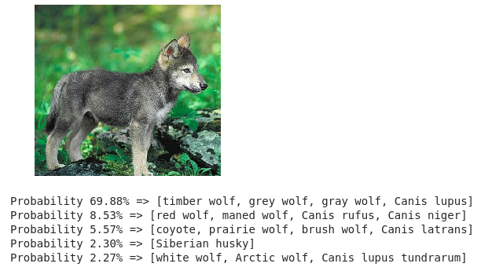

# WORK IN PROGRESS

The aim of this project is to make the amazing tools of deep learning more accessible to non technical people.

The goal is to make a generic API which take a path, read and process videos and give as output for each video:
 - For each animal species:
    - Number of frames this species has been detected
    - At which frame this species has been detected
    - More infos incoming ... 

**Output example**
>'white wolf, Arctic wolf, Canis lupus tundrarum': {'count': 33, 'occurences': [189, 190, 191, 197, 198, 199, 200, 201, 202, 203, 204, 205, 206, 207, 208, 209, 210, 211, 212, 213, 214, 215, 216, 217, 218, 219, 220, 222, 223, 224, 225, 226, 227]

This API is supposed to be used in production in the forests in France by the government to detect wolves



# Installation

```
python3 -m venv env
source env/bin/activate
pip install -r requirements.txt
```

Of course you need everything installed to handle [tensorflow-gpu](https://www.tensorflow.org/install/gpu)

# Usage

```
python run.py [directory_that_contains_videos]
```